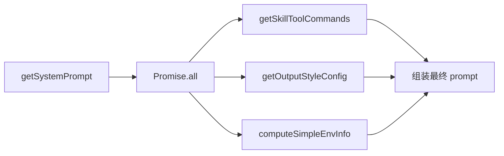

# 从 Prompt 到行为的完整链路

> 基于 `src/constants/prompts.ts`、`src/utils/queryContext.ts`、`src/QueryEngine.ts` 源码分析

## 概述

一个用户输入"帮我修复这个 bug"，Claude Code 是怎么把它变成一连串的文件读取、代码编辑、测试运行的？这篇文章追踪从 prompt 组装到行为产生的完整链路。

## 架构总览

```
用户输入 "帮我修复这个 bug"
  │
  ▼
┌─────────────────────────────────────────────┐
│  1. Prompt 组装层                            │
│     getSystemPrompt() → string[]            │
│       ├── 静态段 (7 段, 可缓存)              │
│       ├── DYNAMIC BOUNDARY                  │
│       └── 动态段 (10+ 段, 按需计算)         │
│     + User Context (CLAUDE.md + 日期)        │
│     + System Context (git 状态)              │
│     + Tool Prompts (运行时注入)              │
│     + Memory Prompts (跨会话持久化)          │
│     + System-reminders (增量注入)            │
│     + Feature Flags (条件段)                 │
├─────────────────────────────────────────────┤
│  2. API 调用层                               │
│     messages + systemPrompt → Claude API     │
│     → 流式返回 text / thinking / tool_use    │
├─────────────────────────────────────────────┤
│  3. 工具执行层                               │
│     tool_use blocks → canUseTool() → call() │
│     → tool_result blocks → 注入回消息历史     │
├─────────────────────────────────────────────┤
│  4. 循环控制层                               │
│     有 tool_use? → 继续                     │
│     无 tool_use? → 结束                     │
└─────────────────────────────────────────────┘
```

## 一、System Prompt 的组装链

### 入口：getSystemPrompt()

`prompts.ts:451` 的 `getSystemPrompt()` 函数是 prompt 组装的入口。它接收工具列表、模型 ID 等参数，返回一个字符串数组（每个元素是一个 prompt block）。

```typescript
export async function getSystemPrompt(
  tools: Tools,
  model: string,
  additionalWorkingDirectories?: string[],
  mcpClients?: MCPServerConnection[],
): Promise<string[]>
```

### 第一步：并行预取

函数开头并行启动三个 I/O 操作（`prompts.ts:~470`）：

```typescript
const [skillToolCommands, outputStyleConfig, envInfo] = await Promise.all([
  getSkillToolCommands(cwd),           // 扫描技能目录
  getOutputStyleConfig(),              // 读取输出风格
  computeSimpleEnvInfo(model, additionalWorkingDirectories),  // 环境信息
])
```

### 第二步：构建动态段

动态段通过 `systemPromptSection` 注册表管理（`prompts.ts:~498`）：

```typescript
const dynamicSections = [
  systemPromptSection('session_guidance', () =>
    getSessionSpecificGuidanceSection(enabledTools, skillToolCommands)
  ),
  systemPromptSection('memory', () => loadMemoryPrompt()),
  systemPromptSection('env_info_simple', () =>
    computeSimpleEnvInfo(model, additionalWorkingDirectories)
  ),
  systemPromptSection('language', () =>
    getLanguageSection(settings.language)
  ),
  systemPromptSection('output_style', () =>
    getOutputStyleSection(outputStyleConfig)
  ),
  DANGEROUS_uncachedSystemPromptSection(
    'mcp_instructions',
    () => isMcpInstructionsDeltaEnabled() ? null : getMcpInstructionsSection(mcpClients),
    'MCP servers connect/disconnect between turns',
  ),
  // ... 更多段
]
```

### 第三步：组装最终数组

```typescript
const resolvedDynamicSections =
  await resolveSystemPromptSections(dynamicSections)

return [
  // --- 静态内容 (可缓存) ---
  getSimpleIntroSection(outputStyleConfig),
  getSimpleSystemSection(),
  getSimpleDoingTasksSection(),
  getActionsSection(),
  getUsingYourToolsSection(enabledTools),
  getSimpleToneAndStyleSection(),
  getOutputEfficiencySection(),
  // === BOUNDARY MARKER ===
  ...(shouldUseGlobalCacheScope() ? [SYSTEM_PROMPT_DYNAMIC_BOUNDARY] : []),
  // --- 动态内容 ---
  ...resolvedDynamicSections,
].filter(s => s !== null)
```

### 调用链总结

```
QueryEngine.submitMessage()
  └─ fetchSystemPromptParts()              ← queryContext.ts
       ├─ getSystemPrompt()                ← prompts.ts (主 prompt 构建)
       │    ├─ Promise.all([...])          ← 并行预取
       │    ├─ register dynamic sections   ← 注册动态段
       │    ├─ resolveSystemPromptSections ← 段缓存解析
       │    └─ [...static, boundary, ...dynamic]
       ├─ getUserContext()                 ← CLAUDE.md + 日期
       └─ getSystemContext()               ← git 状态
  └─ assemble final systemPrompt
       ├─ defaultSystemPrompt (或 custom)
       ├─ + appendSystemPrompt
       ├─ + memory prompt (SDK 自定义路径)
       └─ + coordinator context
```

## 二、Tool Prompt 的运行时注入

每个工具都有一个 `prompt()` 方法（`Tool.ts:430-436`），返回该工具的使用说明：

```typescript
prompt(options: {
  getToolPermissionContext: () => Promise<ToolPermissionContext>
  tools: Tools
  agents: AgentDefinition[]
  allowedAgentTypes?: string[]
}): Promise<string>
```

### 工具 Prompt 的注入位置

工具 prompt 不是写死在 system prompt 里的——它们在 API 请求构建时被动态注入。这是通过 `src/utils/api.ts` 中的 `prependUserContext()` 和 `appendSystemContext()` 实现的。

### ToolSearch 的延迟加载

当启用 `ToolSearch` 时，部分工具的 prompt 被标记为 `shouldDefer: true`。这些工具的完整 schema 不会出现在初始 system prompt 中，而是等到模型通过 `ToolSearchTool` 主动搜索时才注入。

```typescript
// Tool.ts:307-312
readonly shouldDefer?: boolean

// Tool.ts:315-321 — 始终加载标记
readonly alwaysLoad?: boolean
// 当为 true 时，工具的完整 schema 出现在初始 prompt 中
// 即使 ToolSearch 启用也不延迟
```

这种设计减少了初始 prompt 的 token 数量——在大型项目中可能有数十个 MCP 工具，但每个 turn 只用到其中几个。

### 工具列表的动态组装

工具列表在每轮迭代前可能更新（`query.ts:722-730`）：

```typescript
if (updatedToolUseContext.options.refreshTools) {
  const refreshedTools = updatedToolUseContext.options.refreshTools()
  if (refreshedTools !== updatedToolUseContext.options.tools) {
    updatedToolUseContext = {
      ...updatedToolUseContext,
      options: { ...updatedToolUseContext.options, tools: refreshedTools },
    }
  }
}
```

这意味着：如果 MCP 服务器在对话中途连接，新工具可以在下一轮被模型看到。

## 三、Memory Prompt 的跨会话持久化

### 记忆的类型

Claude Code 的记忆系统通过 CLAUDE.md 文件实现。这些文件可以在多个层级存在：

```
~/.claude/CLAUDE.md           ← 全局记忆（所有项目）
项目根目录/CLAUDE.md          ← 项目记忆
子目录/CLAUDE.md              ← 目录级记忆
```

### 记忆的加载

记忆通过 `loadMemoryPrompt()` 加载（`prompts.ts:~495`）。在 `systemPromptSection` 中注册为缓存安全段：

```typescript
systemPromptSection('memory', () => loadMemoryPrompt()),
```

这意味着 CLAUDE.md 的内容在一次对话中只读取一次（首次计算后缓存），后续轮次直接复用。

### 记忆的预取优化

`query.ts:189` 中的记忆预取是性能优化的亮点：

```typescript
using pendingMemoryPrefetch = startRelevantMemoryPrefetch(
  state.messages, state.toolUseContext,
)
```

这个 `using` 声明创建了一个资源管理对象，确保在所有退出路径上正确释放。记忆预取在 API 流式调用期间后台执行，到工具执行完成后才消费结果：

```typescript
// query.ts:748-759
if (
  pendingMemoryPrefetch &&
  pendingMemoryPrefetch.settledAt !== null &&
  pendingMemoryPrefetch.consumedOnIteration === -1
) {
  const memoryAttachments = filterDuplicateMemoryAttachments(
    await pendingMemoryPrefetch.promise,
    toolUseContext.readFileState,
  )
  for (const memAttachment of memoryAttachments) {
    const msg = createAttachmentMessage(memAttachment)
    yield msg
    toolResults.push(msg)
  }
}
```

**关键设计**：记忆不是注入到 system prompt 中，而是作为 **attachment 消息** 追加到对话历史。这样做的好处：

1. 不破坏 prompt 缓存（system prompt 不变）
2. 记忆可以按需加载（只加载与当前任务相关的）
3. 可以通过 `readFileState` 去重（模型已经读过的文件不再注入）

### 嵌套记忆路径

Claude Code 还支持嵌套的 CLAUDE.md 路径追踪（`QueryEngine.ts:71`）：

```typescript
private loadedNestedMemoryPaths = new Set<string>()
```

这确保同一路径的 CLAUDE.md 在一次会话中只注入一次，防止重复注入导致的 token 浪费。

## 四、System-Reminder 标签的增量注入机制

### 什么是 system-reminder

System-reminder 是注入到 tool result 或 user message 中的 XML 标签，包含系统级的上下文信息：

```
<system-reminder>
  ...系统级提醒和上下文...
</system-reminder>
```

System prompt 中明确告知模型这些标签的存在和性质（`getSystemRemindersSection()`）：

```
- Tool results and user messages may include <system-reminder> tags.
  <system-reminder> tags contain useful information and reminders.
  They are automatically added by the system, and bear no direct
  relation to the specific tool results or user messages in which they appear.
```

### 注入时机

System-reminder 在多个时机被注入：

1. **工具结果后**：某些工具执行后会附加 system-reminder（如文件变更通知）
2. **用户消息前**：系统状态变化（如目录变更）会在下一条用户消息前注入
3. **Stop hook 后**：hook 执行结果以 attachment 形式注入

### 注入方式

System-reminder 不改变 system prompt——它被嵌入到对话历史的 message 中。这确保：

1. System prompt 的缓存不被破坏
2. 每个 reminder 的生效范围精确可控（只影响其后的对话上下文）
3. 可以在不同轮次注入不同的 reminder，互不干扰

## 五、Feature Flag 如何影响 Prompt 内容

### 条件编译 vs 运行时检查

Claude Code 使用两种方式控制 feature flag：

**构建时条件编译**（`bun:bundle` 的 `feature()` 函数）：

```typescript
// 提取记忆功能只在启用时导入
const extractMemoriesModule = feature('EXTRACT_MEMORIES')
  ? require('../services/extractMemories/extractMemories.js')
  : null
```

**运行时检查**（Statsig / 环境变量）：

```typescript
// 流式工具执行是运行时 feature gate
const useStreamingToolExecution = config.gates.streamingToolExecution
```

### Feature Flag 对 Prompt 的影响

不同的 feature flag 影响 prompt 的不同部分：

| Feature Flag | 影响位置 | 效果 |
|---|---|---|
| `TOKEN_BUDGET` | 动态段 | 添加 token 预算指引 |
| `KAIROS` / `KAIROS_BRIEF` | 动态段 | 添加 brief 模式指引 |
| `PROACTIVE` / `KAIROS` | 整个路径 | 切换到极简 proactive prompt |
| `COORDINATOR_MODE` | user context | 添加协调器上下文 |
| `EXPERIMENTAL_SKILL_SEARCH` | session_guidance | 添加技能发现指引 |
| `VERIFICATION_AGENT` | session_guidance | 添加验证代理合约 |
| `TOOL_SEARCH` | 工具列表 | 延迟加载非核心工具 |

### Proactive 模式的极简 Prompt

当 `PROACTIVE` 或 `KAIROS` 启用且主动模式激活时，整个 prompt 被替换为极简版本（`prompts.ts:~480`）：

```typescript
if ((feature('PROACTIVE') || feature('KAIROS')) && proactiveModule?.isProactiveActive()) {
  return [
    '\nYou are an autonomous agent. Use the available tools to do useful work.',
    CYBER_RISK_INSTRUCTION,
    getSystemRemindersSection(),
    await loadMemoryPrompt(),
    envInfo,
    getLanguageSection(settings.language),
    getMcpInstructionsSection(mcpClients),
    getScratchpadInstructions(),
    getFunctionResultClearingSection(model),
    SUMMARIZE_TOOL_RESULTS_SECTION,
    getProactiveSection(),
  ].filter(s => s !== null)
}
```

注意：跳过了 7 段静态 prompt（身份、规则、任务指南等），直接进入执行模式。这是为后台自主 agent 设计的——它们不需要"不要用 emoji"之类的对话式指令。

## 六、整个链路的性能优化策略

### 并行化



### 段缓存

```typescript
// 第一次调用：compute() 执行 → 结果存入内存
// 后续调用：直接从内存返回，跳过 compute()
if (!s.cacheBreak && cache.has(s.name)) {
  return cache.get(s.name) ?? null
}
```

### 记忆预取

```
API 流式调用 (5-30s)
  │
  ├── 模型生成 text/thinking/tool_use    ← 主线程
  │
  └── 后台加载相关记忆文件               ← 并行预取
        │
        └── 工具执行完成后消费结果        ← 零额外延迟
```

### 依赖注入（QueryDeps）

`query.ts` 使用依赖注入模式（`query/deps.ts`）：

```typescript
export type QueryDeps = {
  callModel: typeof queryModelWithStreaming
  microcompact: typeof microcompactMessages
  autocompact: typeof autoCompactIfNeeded
  uuid: () => string
}

export function productionDeps(): QueryDeps {
  return {
    callModel: queryModelWithStreaming,
    microcompact: microcompactMessages,
    autocompact: autoCompactIfNeeded,
    uuid: randomUUID,
  }
}
```

这让核心的 `query()` 函数可以被直接测试——注入 fake 实现即可，不需要 mock 整个 API 层。

### 配置快照

`buildQueryConfig()`（`query/config.ts:25`）在 query 入口处快照所有运行时配置：

```typescript
export function buildQueryConfig(): QueryConfig {
  return {
    sessionId: getSessionId(),
    gates: {
      streamingToolExecution: checkStatsigFeatureGate_CACHED_MAY_BE_STALE(...),
      emitToolUseSummaries: isEnvTruthy(process.env.CLAUDE_CODE_EMIT_TOOL_USE_SUMMARIES),
      isAnt: process.env.USER_TYPE === 'ant',
      fastModeEnabled: !isEnvTruthy(process.env.CLAUDE_CODE_DISABLE_FAST_MODE),
    },
  }
}
```

这样做的好处：
1. 避免在循环内重复调用 Statsig API
2. 保证整个 query 过程中配置的一致性
3. CACHED_MAY_BE_STALE 的语义允许这种快照（一次评估，短时间内的结果可信）

## 七、从 Prompt 到行为的完整数据流

```
1. 用户输入
   "帮我修复这个 bug"
        │
        ▼
2. processUserInput()
   ├── 解析为 user message
   ├── 处理斜杠命令（如果有）
   └── 确定 shouldQuery=true
        │
        ▼
3. 组装 system prompt
   ├── getSystemPrompt() → 7 段静态 + 10+ 段动态
   ├── + CLAUDE.md 内容
   ├── + git 状态
   └── + appendSystemPrompt（如有）
        │
        ▼
4. 组装 messages
   ├── system prompt → [system message]
   ├── 对话历史 → [user, assistant, user, ...]
   └── 当前输入 → [user message: "帮我修复这个 bug"]
        │
        ▼
5. callModel() — 流式 API 调用
   ├── thinking blocks → 模型的思考过程
   ├── text blocks → 模型的文字回应
   └── tool_use blocks → 工具调用请求
        │
        ▼
6. 解析 tool_use blocks
   ├── {"name": "Read", "input": {"file_path": "src/foo.ts"}}
   ├── {"name": "Grep", "input": {"pattern": "bug.*function"}}
   └── needsFollowUp = true
        │
        ▼
7. 权限检查
   ├── Read → alwaysAllow (只读) → allow
   ├── Grep → alwaysAllow (只读) → allow
   └── 执行工具
        │
        ▼
8. 工具执行
   ├── Read("src/foo.ts") → 返回文件内容
   ├── Grep("bug.*function") → 返回匹配结果
   └── 生成 tool_result blocks
        │
        ▼
9. 注入结果到消息历史
   messages.push(tool_results)
        │
        ▼
10. 回到步骤 5（下一轮迭代）
    ├── 如果还有 tool_use → 继续
    └── 如果没有 tool_use → 结束
        │
        ▼
11. yield 最终结果
    "已修复 src/foo.ts:42 的空指针异常"
```

## 总结

从 prompt 到行为的完整链路是一个**多层组装 + 流式执行 + 循环驱动**的过程：

1. **Prompt 组装**是分层的：system prompt（静态+动态）、user context、system context、tool prompt、memory prompt 各自独立组装，最后合并
2. **Tool prompt 是运行时注入的**：不在 system prompt 中硬编码，而是根据当前启用的工具动态生成
3. **Memory 是作为 attachment 注入的**：不破坏 system prompt 的缓存结构
4. **System-reminder 是增量注入的**：嵌入到对话历史中，不影响 system prompt
5. **Feature flag 是多层次的**：构建时条件编译 + 运行时检查，分别控制代码是否打包和逻辑是否执行
6. **性能优化贯穿始终**：并行预取、段缓存、记忆预取、依赖注入、配置快照

这条链路的核心哲学是：**每个环节都是可测试、可替换、可优化的独立模块**。这让 Claude Code 能够在保持架构简洁的同时，实现复杂的 prompt 工程优化。
